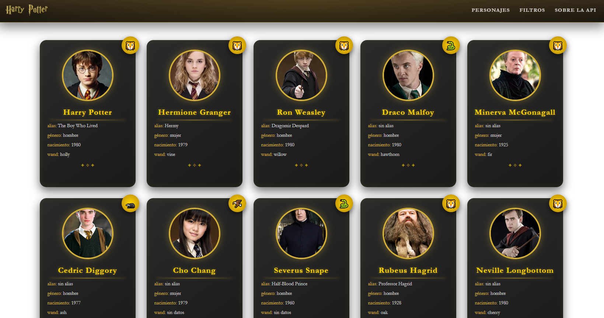

# Proyecto: apiHarryPotter

## 📝 Descripción
------------------------
'apiHarryPotter' es una aplicación web que consume datos relacionados con el universo de Harry Potter mediante peticiones `fetch` a un archivo JSON. Muestra información de personajes y recursos relacionados, y sirve como ejercicio práctico para aprender a consumir APIs reales y adaptar la UI a los datos recibidos.

## 👥 Autores
------------------------
- David Navarro
- Yves Elianor
- Sergio Fernandez
- María Perez
- Juan Luís Márquez

## 🎯 Objetivo
------------------------
Aprender a consumir una API real, y forzarnos a adaptarnos a ella.

## ⚙️ Características
------------------------
- Consumo de API con JavaScript (`js/fetchApi.js`).
- Interfaz modular con fragmentos HTML en archivos independientes (`html/header.html`, `html/footer.html`).
- Estilos organizados en `css/`.
- CSS común(base.css) para dar consistencia, y archivos independientes a mayores para todo lo que no era común.

## 🏗️ Estructura del proyecto
------------------------

apiHarryPotter/
├── index.html
├── css/
│   ├── base.css
│   ├── cards.css
│   └── header.css
│   └── footer.css
├── js/
│   ├── fetchApi.js
│   ├── header.js
│   └── footer.js
├── html/
│   ├── header.html
│   └── footer.html
├── images/
│   └── logoHarryPotter.png
│   └── websiteHarryPotter1.png
│   └── websiteHarryPotter2.png
├── fonts/
└── README.md

## 💻 Instalación y Uso
------------------------
🚀 Instalación y Uso

1️⃣ Clonar el repositorio

git clone https://github.com/andreselianor/apiHarryPotter.git

2️⃣ Abrir el proyecto

No es necesario instalar dependencias.
Solo abre el archivo index.html en tu navegador.

3️⃣ Versión online

El proyecto está disponible directamente en:

https://andreselianor.github.io/apiHarryPotter/

## 🧩 Consumo de la API en una Aplicación Web 
------------------------

### 🎯 Idea clave
- 🔑 **La API solo proporciona datos en formato JSON.**
- 🤝 **JavaScript es el intermediario** que conecta la API con el servicio para el cliente web.

### 🌐 1. Acceso a la página web
- 🖥️ Cuando el usuario entra en una página web, el navegador descarga los archivos principales del proyecto: **HTML**, **CSS** y **JavaScript**.  
- 🧱 El HTML define la estructura, el CSS el diseño visual y JavaScript controla el comportamiento de la aplicación.
- ⏳ En este punto, la web aún no muestra datos de la API, solo tiene la estructura preparada para recibirlos.

### 🔗 2. Peticiones a la API
- 📡 Para obtener datos externos, JavaScript utiliza la función **`fetch()`**.
- 📬 `fetch()` realiza una **petición HTTP GET** a un endpoint de una API.

### 📦 3. Recepción de datos
- 📄 La API devuelve los datos en formato **JSON**.
- 🔄 Mediante `response.json()`, el JSON se convierte en **objetos JavaScript**.

### 🗂️ 4. Almacenamiento y procesamiento
- 🧾 Los datos se guardan en **arrays u objetos** JavaScript.
- 🔍 Se pueden recorrer, filtrar o transformar según la lógica de la aplicación.
- 🧩 Cada objeto contiene propiedades accesibles con notación de punto (`objeto.propiedad`).

### 🎨 5. Generación dinámica del contenido
- 🏗️ JavaScript crea elementos HTML de forma **dinámica**.
- ➕ Estos elementos se insertan en el DOM usando métodos como `createElement` o `innerHTML`.

### 👀 6. Visualización en el navegador
- 🔄 Al modificarse el DOM, el navegador actualiza la vista automáticamente.
- ✨ El usuario ve los datos sin necesidad de recargar la página.
- 🧙‍♂️ La información mostrada proviene directamente de la API.

## 🤝 Contribuir
---------
1. Haz fork del repositorio.
2. Crea una rama: `git checkout -b feat/mi-cambio`.
3. Envía un pull request con descripción clara de los cambios.

## 📄 Licencia
---------
CC-BY
